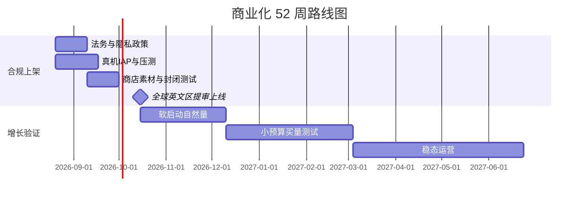

# Texas Hold'em 商业化启动计划书

| 项目 | 内容 |
|------|------|
| 文档版本 | v1.7 |
| 更新日期 | 2026-08-20 |
| 适用代码分支 | `cursor/phase4-open-beta-2fc9` |
| 权威产品规格 | `PRD-完整版-v2.0.md`、`10-版本范围规划.md` |
| 汇率假设 | 1 USD ≈ 7.20 CNY（报价换算用，实际以付款日汇率为准） |

---

## 目录

1. [执行摘要](#一执行摘要)
2. [战略决策（已锁定）](#二战略决策已锁定)
3. [现状评估](#三现状评估)
4. [市场与上架策略](#四市场与上架策略)
5. [产品与功能范围](#五产品与功能范围)
6. [私人场公测方案](#六私人场公测方案)
7. [变现与经济模型](#七变现与经济模型)
8. [组织与分工](#八组织与分工)
9. [预算表（人民币）](#九预算表人民币)
10. [时间表（52 周）](#十时间表52-周)
11. [KPI 与收入预测](#十一kpi-与收入预测)
12. [合规与风险管理](#十二合规与风险管理)
13. [数据与运营体系](#十三数据与运营体系)
14. [30 天行动清单](#十四30-天行动清单)
15. [待确认事项](#十五待确认事项)

---

## 一、执行摘要

Texas Hold'em 是一款跨端（iOS / Android / Web）社交竞技德州扑克产品，采用**单向封闭筹码经济**（筹码仅可通过官方充值或活动获得，不可兑换法币、不可玩家间转移）。

**商业化核心路径**：完成全球英文区 App Store / Google Play 上架 → 真实 IAP 收款 → 以私人场作为差异化留存与裂变抓手 → 精益预算验证单位经济模型 → 数据达标后再加码投放。

| 维度 | 结论 |
|------|------|
| 产品定位 | 社交竞技德州扑克，娱乐筹码，非真钱博彩 |
| 变现模式 | IAP 充值（主）+ 官方场 5% / 私人场 3% rake（回收） |
| 当前技术阶段 | 约 **v1.1 公测前 80%**（IAP 验单、合规、双榜、运营后台、私人场均已具备） |
| 首发市场 | **全球英文区**（单一英文商店页，全球分发） |
| 团队模式 | **精益团队**，首年现金预算 **≤ ¥61.2 万**（约 $85,000，含 APP UI 设计） |
| 私人场 | **公测即开**，配合强风控与后台熔断 |
| 首年目标（保守） | 累计注册 5–10 万，月活 8,000–15,000，付费率 3–5% |
| 首年毛流水目标 | ¥58 万 – ¥144 万（约 $8 万 – $20 万） |

**核心判断**：产品经济闭环设计成熟，但「能收钱」≠「能规模化赚钱」。商业化成败取决于 **商店过审、首月留存、破产转化、合规零事故**，而非继续堆功能。

---

## 二、战略决策（已锁定）

| # | 决策项 | 选定方案 | 执行含义 |
|---|--------|----------|----------|
| 1 | 首发市场 | **全球英文区** | App Store / Google Play 以 English (U.S.) 为主语言全球发布；应用内保留 en-US（主）+ zh-CN |
| 2 | 团队规模 | **精益（< ¥65 万/年）** | 全年现金硬顶 ¥61.2 万（含 UI 设计 ¥7.2 万）；买量全年 ¥18 万；以自然量 + T1 三国付费测试为主 |
| 3 | 私人场 | **公测即开** | v1.1 上线时私人场全开，作为差异化与社交裂变抓手；保留后台一键暂停能力 |
| 4 | 筹码迁移 | **方案 A（已确认）** | 公测全员清零，重新赠送 100 筹码；提前 7 天公告 + App 内确认弹窗 |
| 5 | 美国买量 | **不列入 T1（已确认）** | 全球可下载，但付费投放不含美国；美国仅自然量 + ASO，M12 前再评估 |
| 6 | 研发模式 | **创始人自研（已确认）** | 上架冲刺与全年维护由创始人完成；研发现金预算压缩至 ¥7.2 万，节省 ¥11.5 万转投买量与储备 |

### 2.1 一句话战略

> 用最小成本完成全球英文区上架与真实 IAP，以私人场差异化提高时长与传播，6 个月内验证 LTV/CPI，再决定是否扩量。

---

## 三、现状评估

### 3.1 已完成（可支撑商业化）

| 模块 | 状态 | 商业价值 |
|------|------|----------|
| 官方 9 人场 + Bot 补位 | ✅ | 核心对局体验，P99 开局 ≤5s |
| 私人场（开房、踢人、Re-buy、解散投票） | ✅ | 社交组局、差异化 |
| 举报 + Chip dumping 24h 检测 | ✅ | 合规与风控基础 |
| OAuth（Apple / Google）+ Refresh Token | ✅ | 账号体系、游客转正 |
| IAP 验单（Apple / Google）+ 商品目录 | ✅ 沙盒可用 | 变现基础设施 |
| 首充赠送 50%、日充值限额 50,000 | ✅ 可配置 | 转化杠杆 |
| 18+ 自声明、自我封禁 | ✅ | 商店审核必备 |
| 双排行榜 + 隐身模式 | ✅ | 竞技留存 |
| 运营后台（用户详情、经济看板、系统配置） | ✅ | 日常运营 |
| 内测 → 公测迁移确认流程 | ✅ | 筹码清档公告 |

### 3.2 商业化缺口（Must-Have）

| 缺口 | 优先级 | 说明 |
|------|--------|------|
| App Store / Google Play 正式上架 | P0 | 开发者账号、隐私政策、审核包 |
| 真机 IAP 联调（StoreKit / Play Billing） | P0 | Web 沙盒 ≠ 真机收入 |
| 生产环境 IAP 凭证与订单对账 | P0 | 共享密钥、服务账号 |
| 压测与容量规划（Phase 5） | P0 | 公测流量扛不住 = 收入归零 |
| 数据分析体系（漏斗 / 留存 / LTV） | P0 | 无法优化 = 盲投 |
| 英文法务文件（Privacy / ToS / RG） | P0 | 全球英文区审核必备 |
| 英文商店素材（截图、视频、描述） | P1 | ASO 与过审 |
| 客服与客诉 SLA | P1 | IAP 退款、封号申诉 |
| 活动 CMS / Push 召回 | P2 | v1.5 前可用简易方案替代 |

### 3.3 竞品与差异化

| 维度 | 本产品 | 典型竞品（Zynga Poker 等） |
|------|--------|---------------------------|
| 经济模型 | 单向封闭、无提现 | 同类 |
| 差异化 | 私人场组局、双榜竞技、Bot 快速开局 | 品牌与用户量 |
| 当前弱点 | 无好友 / 成就 / 皮肤、品牌为零 | 社交图谱深、运营成熟 |

---

## 四、市场与上架策略

### 4.1 全球英文区发布方案

| 项 | 方案 |
|----|------|
| App Store | 全球发布，Primary Language：**English (U.S.)** |
| Google Play | 全球发布（除无法分发地区） |
| 应用内语言 | `en-US`（主）+ `zh-CN`（华人用户自然覆盖） |
| 定价基准 | 美元标价（$0.99 / $4.99 / $9.99），商店自动本地化 |

### 4.2 市场分层（精益投放用）

不做分国家独立运营，买量测试按 Tier 分批。**美国可全球下载，但一律不进入 T1 付费投放池。**

| Tier | 市场 | 策略 | 原因 |
|------|------|------|------|
| **T1 测试池（付费）** | 加拿大、澳大利亚、新西兰 | 首波小预算 UAC / Meta | 监管相对清晰，CPI 低于美国 |
| **T2 自然量** | **美国**、英国、爱尔兰 | **仅 ASO + 口碑，全年不买量** | CPI 高（约 ¥36–¥72）；合规与素材要求更严 |
| **T3 观察** | 印度、东南亚英文用户 | 仅自然量 | ARPPU 偏低 |

> **美国特别说明**：App Store / Google Play 仍全球发布（含美国），用户可自然搜索下载；Meta / Google UAC 等广告**不得定向美国**，直至 T1 市场 LTV/CPI 达标且完成美国合规专项审查（预计 M10+ 再议）。

### 4.3 商店与合规文案（英文区）

**必须使用：**
- Social poker / Entertainment chips
- No real money gambling / No cash out
- 18+ age gate、Responsible Gaming、Self-exclusion

**必须避免：**
- Real money、Cash prizes、Gambling、Win money

**私人场表述：**
- Private tables with friends（社交组局）
- 不提赌注、现金、奖金

### 4.4 必备法律文档（英文）

| 文档 | 用途 |
|------|------|
| Privacy Policy | 商店审核、GDPR / CCPA 基础 |
| Terms of Service | 用户协议 |
| Responsible Gaming Policy | 自我封禁、年龄声明说明 |
| 官网 Landing Page | 商店链接要求，可用 GitHub Pages（成本极低） |

---

## 五、产品与功能范围

### 5.1 公测版本范围（v1.1）

| 模块 | 范围 | 验收标准 |
|------|------|----------|
| 官方场 | 9 人桌、1/2 盲注、5% rake | 完整一局可结算 |
| 私人场 | 2–9 人、3% rake、开房费 100 筹码 | **公测即开** |
| 支付 | Apple IAP + Google Play | 沙盒 / 生产到账 |
| 内测迁移 | 筹码清档 + 重新赠送 100 | 提前 7 天公告 |
| 排行榜 | 盈利榜 + 单局最高榜，10 分钟刷新 | 大厅 Top3 展示 |
| 合规 | 18+ 自声明、Responsible Gaming、自我封禁 | 商店审核通过 |
| 首充活动 | 首充额外赠送 50%（可配置） | 独立弹窗 |
| 后台 | 用户详情、经济看板、系统配置、举报工单 | 运营三板斧可用 |

### 5.2 公测不包含（延后至 v1.5+）

- GTO Bot 引擎
- 好友系统
- 成就 / 称号 CMS
- 多盲注官方场（2/4、5/10）
- 对局回放 UI
- 皮肤 / VIP（v2.5）
- Web 支付 Stripe / USDC（v2.0）

### 5.3 技术收尾清单（上架前）

| 任务 | 优先级 | 预估工作量 |
|------|--------|------------|
| 真机 `expo-iap` 生产联调 | P0 | 1–2 人周 |
| IAP 凭证配置与对账脚本 | P0 | 0.5 人周 |
| 压测（300 并发连接 / 50 同桌） | P0 | 1 人周 |
| Firebase Analytics + 充值漏斗 | P0 | 0.5 人周 |
| 英文商店素材 | P0 | 外包 1 周 |
| 英文法务三件套 | P0 | 外包 2–3 周 |
| Crashlytics + 基础告警 | P1 | 0.5 人周 |

---

## 六、私人场公测方案

私人场是差异化，也是合规重点。采用 **「全开 + 强风控 + 可熔断」** 策略。

### 6.1 公测上线配置

| 模块 | 公测状态 | 说明 |
|------|----------|------|
| 开房权限费 | **开启** | 100 筹码一次性 |
| Rake | **3%** | 低于官方场 5% |
| 2 人局限制 | **开启** | 房主需官方场 ≥10 局 |
| 举报入口 | **开启** | 牌桌 + 后台工单 |
| Chip dumping 检测 | **开启** | 24h 滚动窗口 |
| 全局熔断开关 | **常备** | `private_room_global_pause`，1 分钟内全关 |
| 解散规则 | **≥2/3 同意** | 已实现 |

### 6.2 公测首月运营规则

| 规则 | 动作 |
|------|------|
| 举报 ≥3 次 / 房间 / 24h | 自动冻结房间 + 人工复核 |
| 后台每日巡检 | 经济看板查看私人场 rake 占比 |
| 异常飙升 | 查 dumping，必要时暂停私人场 |
| 客诉话术 | 英文 FAQ：筹码不可提现、私人场仅供娱乐 |

### 6.3 私人场对收入的预期贡献

| 指标 | 保守预期 | 说明 |
|------|----------|------|
| 开房率（占 DAU） | 5–8% | PRD v1.1 目标 |
| 对 IAP 贡献 | 间接为主 | 组局 → 消耗 → 破产 → 充值 |
| 对 rake 贡献 | 10–20% 总 rake | 局数少于官方场，但提高时长 |

---

## 七、变现与经济模型

### 7.1 收入结构

| 来源 | 机制 | 阶段 |
|------|------|------|
| **IAP 充值** | 1 USD = 1 筹码，平台抽成 15–30% | v1.1 主收入 |
| **官方场 rake** | 5%，No Flop No Drop，向下取整 | 持续 |
| **私人场 rake** | 3% | 公测即开 |
| **开房权限费** | 100 筹码一次性 | 私人场 |

### 7.2 商品定价（沿用现有目录）

| 商品 ID | 筹码 | 标价（USD） | 标价（CNY 参考） | 定位 |
|---------|------|-------------|------------------|------|
| com.texasholdem.chips.100 | 100 | $0.99 | ¥7 | 冲动消费 / 首充试探 |
| com.texasholdem.chips.500 | 500 | $4.99 | ¥36 | 主力 SKU |
| com.texasholdem.chips.1000 | 1000 | $9.99 | ¥72 | 中度玩家 |

### 7.3 运营杠杆（已具备配置能力）

| 杠杆 | 配置项 | 建议（公测首月） |
|------|--------|------------------|
| 首充赠送 | `first_recharge_bonus_pct` = 50% | **开启** |
| 新用户 rake 减半 | `newbie_protection_enabled` | **建议开启**（前 7 天 2.5%） |
| 日充值限额 | `daily_recharge_limit` = 50,000 | 保持 |
| Bot 日亏损预算 | `bot_daily_budget` = 500,000 | 保持，监控告警 |

### 7.4 单位经济模型（基准假设）

| 指标 | 保守 | 基准 | 乐观 |
|------|------|------|------|
| CPI（安装成本） | ¥18 | ¥13 | ¥9 |
| 注册 → 付费转化 | 2.5% | 4% | 6% |
| ARPPU（月） | ¥43 | ¥86 | ¥144 |
| D7 留存 | 10% | 15% | 22% |
| 平台抽成后净收入率 | ~70% | ~70% | ~70% |

### 7.5 内测 → 公测筹码迁移

| 方案 | 规则 | 建议 |
|------|------|------|
| **方案 A（推荐）** | 公测清零，重新赠送 100 筹码，提前 7 天公告 | ✅ 全球英文区首选，纠纷最少 |
| 方案 B | mock 充值部分 ×0.1 折算，需用户勾选确认 | 内测付费用户多时再考虑 |

---

## 八、组织与分工

### 8.1 精益团队编制（自研版）

| 角色 | 投入方式 | 职责 |
|------|----------|------|
| **创始人（全栈自研）** | 全职或主力 | 产品、后端、移动端、IAP 联调、压测、监控、发版 |
| 运营 | 创始人兼 | 社群、客诉、数据日报、ASO |
| 增长 | 创始人兼 | 小预算投放（T1 三国） |
| 法务 | 外包 | 英文 Privacy / ToS / RG |
| 客服 | 外包或工具 | 工单、退款协助 |
| 设计（商店素材 + UI） | 外包一次性 | 商店截图 / 视频 + App 内界面；**三期合同 ¥10.8 万** |

> 不再安排研发外包；创始人需预留 **Q1 约 6–8 人周** 完成上架技术收尾（见下方自研交付清单）。

### 8.2 创始人自研交付清单（Q1 上架期）

| 任务 | 优先级 | 预估工时 |
|------|--------|----------|
| 真机 IAP 生产联调（iOS + Android） | P0 | 1.5–2 周 |
| 压测（300 CCU）+ 容量报告 | P0 | 1 周 |
| 监控告警（日志 / Uptime / 基础 Dashboard） | P0 | 0.5 周 |
| Firebase Analytics 充值漏斗 | P0 | 0.5 周 |
| 公测清档脚本（方案 A） | P0 | 0.5 周 |
| Crashlytics + 发版流水线 | P1 | 0.5 周 |
| **Q1 合计** | | **约 4–5 周净研发** |

### 8.3 自研现金支出（非人力）

| 项目 | 预算（人民币） | 说明 |
|------|---------------|------|
| 测试真机（二手 iPhone / Android） | ¥3,000 – ¥8,000 | 若无现成设备 |
| Apple 开发者 + Google Play | ¥870 | 账号费 |
| 监控 / 日志 SaaS | ¥3,000 – ¥6,000/年 | 免费档为主，按需升级 |
| 域名 + 静态托管 | ¥100 – ¥500/年 | 官网 |
| 开发者工具订阅 | ¥0 – ¥3,000 | 视现有工具链 |
| **全年研发现金合计** | **约 ¥72,000** | 含 Q2–Q4 维护与小工具 |

---

## 九、预算表（人民币）

> **已采用创始人自研版预算**（v1.4）  
> 全年现金硬顶：**¥612,000**（较 v1.3 **+¥72,000** APP UI 设计）；研发外包节省 **¥115,200** 已转投买量  
> 汇率：1 USD = 7.20 CNY

### 9.1 年度总预算（自研版 · 已确认）

| 类别 | Q1 上架期 | Q2 验证期 | Q3 稳态 | Q4 稳态 | **全年合计** | 较外包版 |
|------|-----------|-----------|---------|---------|-------------|----------|
| 研发（工具 / 设备 / SaaS） | ¥28,800 | ¥14,400 | ¥14,400 | ¥14,400 | **¥72,000** | **-¥115,200** |
| 云基础设施 | ¥10,800 | ¥14,400 | ¥18,000 | ¥21,600 | **¥64,800** | — |
| 商店账号与工具 | ¥1,440 | ¥2,160 | ¥2,160 | ¥2,160 | **¥7,920** | — |
| 法务合规（英文） | ¥43,200 | ¥7,200 | ¥3,600 | ¥3,600 | **¥57,600** | — |
| 设计 / 商店素材 | ¥21,600 | ¥7,200 | ¥3,600 | ¥3,600 | **¥36,000** | — |
| **APP UI / UX 设计** | **¥61,200** | **¥7,200** | **¥2,160** | **¥1,440** | **¥72,000** | **+¥72,000** |
| 数据分析 SaaS | ¥3,600 | ¥7,200 | ¥10,800 | ¥10,800 | **¥32,400** | — |
| 客服与工单工具 | ¥3,600 | ¥10,800 | ¥14,400 | ¥18,000 | **¥46,800** | — |
| **用户获取（买量）** | ¥0 | ¥43,200 | ¥68,400 | ¥68,400 | **¥180,000** | **+¥64,800** |
| 应急储备 | — | — | — | — | **¥102,480** | **+¥45,600** |
| **季度合计** | **¥174,240** | **¥113,760** | **¥140,520** | **¥139,800** | **¥612,000** | — |

**节省再分配说明：**

| 去向 | 金额（人民币） |
|------|---------------|
| 研发外包节省 | ¥115,200 |
| → 加码 T1 买量（加 / 新西兰测试） | +¥64,800 |
| → 应急储备 | +¥45,600 |
| → 创始人人力 | 不计入现金预算 |

### 9.2 分项报价明细

#### 9.2.1 研发（创始人自研 · 仅现金支出）

| 项目 | 报价（人民币） | 说明 |
|------|---------------|------|
| 测试真机 | ¥3,000 – ¥8,000 | 一次性，若无设备 |
| 监控 / 日志工具 | ¥3,000 – ¥6,000/年 | 免费档 + 按需升级 |
| 开发者账号与域名 | ¥1,000 | 见 9.2.3 |
| Q2–Q4 工具与小额 SaaS | ¥20,000 – ¥30,000 | 维护期 |
| **研发现金合计** | **约 ¥72,000** | 人力由创始人承担，不计入现金 |

> 原外包报价（仅供参考，**不再采用**）：真机 IAP ¥2.5–4 万、压测 ¥1.5–2.5 万、埋点 ¥0.5–1 万。

#### 9.2.2 云基础设施

| 阶段 | DAU | 月费（人民币） | 配置 |
|------|-----|---------------|------|
| 软启动 M1–M2 | 300–1,500 | ¥1,800 – ¥3,600 | 1×API、1×Room、小 PG、单 Redis |
| 验证 M3–M6 | 1,500–5,000 | ¥3,600 – ¥8,600 | 2×API、2×Room |
| 稳态 M7–M12 | 5,000–15,000 | ¥8,600 – ¥18,000 | 按需扩容，单区域 |

| 云厂商参考 | 月费 |
|------------|------|
| AWS / GCP 轻量配置 | ¥1,500 – ¥3,000 |
| 数据库 RDS（小规格） | ¥500 – ¥1,500 |
| Redis | ¥300 – ¥800 |
| 域名 + SSL + CDN | ¥100 – ¥500 |
| **全年云资源合计** | **¥50,000 – ¥72,000** |

#### 9.2.3 商店与账号

| 项目 | 报价（人民币） | 周期 |
|------|---------------|------|
| Apple Developer Program | ¥688 | /年 |
| Google Play 开发者 | ¥180 | 一次性 |
| 域名（.com） | ¥60 – ¥100 | /年 |
| GitHub Pages / 静态托管 | ¥0 | — |
| **合计** | **约 ¥930 – ¥970** | 首年 |

#### 9.2.4 法务合规

| 项目 | 报价（人民币） | 说明 |
|------|---------------|------|
| Privacy Policy（英文） | ¥3,000 – ¥8,000 | 含 GDPR / CCPA 基础条款 |
| Terms of Service（英文） | ¥3,000 – ¥8,000 | 含筹码不可提现条款 |
| Responsible Gaming Policy | ¥2,000 – ¥5,000 | 自我封禁、年龄声明 |
| 合规咨询（1–2 小时） | ¥2,000 – ¥5,000 | 全球英文区 gambling 边界意见 |
| **法务合计** | **¥10,000 – ¥26,000** | 预算列支 ¥57,600，含修订 |

#### 9.2.5 设计外包预算明细（商店素材 + APP UI）

**商店素材（¥36,000）**

| 项目 | 报价（人民币） | 说明 |
|------|---------------|------|
| App 图标优化 | ¥500 – ¥2,000 | 商店与 App 内 |
| 商店截图 6 张（含 iPad） | ¥2,000 – ¥5,000 | App Store + Google Play |
| 预览视频 30s | ¥3,000 – ¥8,000 | 商店审核用 |
| 英文商店描述文案 | ¥1,000 – ¥3,000 | 可自写 |
| ASO 素材修订（2–3 轮） | ¥3,000 – ¥9,000 | Q2–Q4 迭代 |
| **商店素材合计** | **¥6,500 – ¥18,000** | 预算列支 **¥36,000** |

**APP UI / UX 设计（¥72,000）**

> PRD 要求拟物化牌桌、大厅、商城等完整视觉；当前代码为功能骨架，公测前需专业 UI 设计 + 切图标注交付开发。

| 项目 | 报价（人民币） | 说明 |
|------|---------------|------|
| 设计规范 / Design Token | ¥8,000 – ¥15,000 | 色彩、字体、筹码 / 卡牌样式 |
| 核心页面 UI（Figma） | ¥25,000 – ¥45,000 | 大厅、商城、设置、引导页 |
| 牌桌对局 UI（重点） | ¥20,000 – ¥40,000 | 9 人桌布局、下注区、公共牌、动效标注 |
| 私人场 / 弹窗 / 空状态 | ¥8,000 – ¥18,000 | 开房、破产、首充、举报等 |
| 切图标注 + 开发交付 | ¥5,000 – ¥12,000 | Redline、@1x/@2x/@3x 资源包 |
| 公测迭代修订（2–3 轮） | ¥10,000 – ¥24,000 | Q2–Q4 按反馈调整 |
| **UI 设计合计** | **¥50,000 – ¥120,000** | 预算列支 **¥72,000** |
| **设计外包总计** | | **¥108,000** |

#### 9.2.6 设计外包 · 三期付款计划（UI + 商店素材 · ¥108,000）

> 付款节点：每期验收通过后 **3 个工作日内**支付；第三期最晚 **W12** 前结清。

| 期次 | 计划时间 | App UI 交付 | 商店素材交付 | 验收标准 | 付款金额 | 累计已付 |
|------|----------|-------------|-------------|----------|----------|----------|
| **第一期** | **W1 – W2** | Design Token；大厅 / 商城 / 设置 / 引导页高保真 | App 图标（商店 + App 内） | 设计规范 + 核心页 + 图标评审通过 | **¥30,000** | ¥30,000 |
| **第二期** | **W3 – W5** | 9 人牌桌 UI；私人场 / 弹窗 / 空状态；切图标注 + 资源包 | 商店截图 6 张；预览视频 30s；英文商店描述 | 牌桌 UI + Redline 完整；截图 / 视频可用于提审 | **¥42,900** | ¥72,900 |
| **第三期** | **W5 – W12** | 开发联调修订 1 轮；公测反馈 UI 迭代 ≤2 轮；源文件归档 | ASO 素材修订（2–3 轮）；提审 / 上架反馈调整 | 创始人终验签字；无 P0 视觉阻塞项 | **¥35,100** | **¥108,000** |

| 子项 | 第一期 | 第二期 | 第三期 | 合计 |
|------|--------|--------|--------|------|
| APP UI / UX | ¥28,800 | ¥32,400 | ¥10,800 | **¥72,000** |
| 商店素材 | ¥1,200 | ¥10,500 | ¥24,300 | **¥36,000** |
| **合计** | **¥30,000** | **¥42,900** | **¥35,100** | **¥108,000** |

#### 9.2.7 数据分析 SaaS

| 工具 | 月费（人民币） | 全年 |
|------|---------------|------|
| Firebase（免费档 → Blaze） | ¥0 – ¥500 | ¥0 – ¥6,000 |
| Mixpanel / Amplitude 免费档 | ¥0 | ¥0 |
| 付费档（MAU > 5,000 后） | ¥1,500 – ¥3,000 | ¥18,000 – ¥36,000 |
| **全年合计** | | **¥5,000 – ¥32,000** |

#### 9.2.8 客服与工单

| 方案 | 月费（人民币） | 全年 |
|------|---------------|------|
| 免费：邮件 + Discord | ¥0 | ¥0 |
| Zendesk / Intercom 入门 | ¥500 – ¥1,500 | ¥6,000 – ¥18,000 |
| 兼职客服（旺季） | ¥3,000 – ¥5,000 | ¥12,000 – ¥20,000 |
| **全年合计** | | **¥6,000 – ¥47,000** |

#### 9.2.9 用户获取（买量）

| 阶段 | 预算（人民币） | 市场 | 目的 |
|------|---------------|------|------|
| Q1 软启动 | ¥0 | — | 自然量 + 社群 |
| Q2 小预算测试 | ¥43,200 | 加拿大 + 澳洲 + 新西兰（**不含美国**） | CPI、付费率基线 |
| Q3 扩量测试 | ¥68,400 | T1 三国加码 | LTV/CPI 验证 |
| Q4 稳态 | ¥68,400 | 维持 ROI 正渠道 | 视数据决策 |
| **全年买量合计** | **¥180,000** | | 较外包版 **+¥64,800** |

> **买量纪律**：若 LTV/CPI < 0.6，立即停止 Q3–Q4 买量，预算转入产品优化或储备。

### 9.3 历史外包版预算（v1.3 前 · 仅作对照）

| 类别 | 外包版 | 自研版（v1.3） | 自研版（v1.6 · 当前） | 差额 |
|------|--------|----------------|----------------------|------|
| 研发 | ¥187,200 | ¥72,000 | ¥72,000 | -¥115,200 |
| APP UI 设计 | — | — | ¥72,000 | +¥72,000 |
| 买量 | ¥115,200 | ¥180,000 | ¥180,000 | +¥64,800 |
| 应急储备 | ¥56,880 | ¥102,480 | ¥102,480 | +¥45,600 |
| **全年合计** | ¥540,000 | ¥540,000 | **¥612,000** | **+¥72,000** |

### 9.4 全项目外包方案（审慎报价 · v1.0）

> **完整文档：** `docs/local/全项目外包技术报价书.md`  
> **适用场景：** 研发、UI 落地、QA、DevOps 全部由供应商交付，接场现有代码（约 80% 完成度）。

| 类别 | 自研版（§9.1） | **全项目外包（审慎）** | 差额 |
|------|---------------|----------------------|------|
| 研发 + UI 落地 + QA + PM | 创始人承担 | **¥708,000** | +¥708,000 现金 |
| 设计 + 商店素材 | ¥108,000 | 含在上项 | — |
| 法务 | ¥57,600 | **¥60,000** | +¥2,400 |
| 云 + SaaS | ¥184,320 | **¥184,320** | — |
| 买量 + 储备 | ¥282,480 | **不含** | — |
| **首年技术总包** | **¥612,000**¹ | **¥890,000** | **+¥278,000** |

¹ 自研版含买量 ¥18 万与储备；外包报价**仅技术交付**，不含买量。

**全项目三期付款（¥890,000）**

| 期次 | 时间 | 关键交付 | 付款 |
|------|------|----------|------|
| 第一期 | W1 – W4 | 接场审计；设计规范 + 核心页；IAP / OAuth 启动；Staging | **¥320,000** |
| 第二期 | W5 – W8 | 牌桌 UI 落地；商店素材；压测；提审 | **¥375,000** |
| 第三期 | W9 – W12 | 正式上线；QA 终验；Hypercare 30 天 | **¥195,000** |

**审慎原则摘要：** 工时取上限 · Senior ¥2,400/人日 · 独立 QA · PM 12% · 不可预见费 10% · 范围锁死 v1.1。

---

## 十、时间表（52 周）

### 10.1 总览

```
W1–W8   上架冲刺 → 全球英文区提审上线（私人场全开）
W9–W16  软启动   → 自然量验证，不买量
W17–W28 小预算验证 → 加拿大/澳洲/新西兰买量 ¥4.3万
W29–W52 稳态运营  → 月买量上限 ¥2.3万，筹备 v1.5
```

### 10.2 Phase 0：全球英文上架冲刺（第 1–8 周）

| 周次 | 里程碑 | 交付物 | 预算消耗 |
|------|--------|--------|----------|
| W1 | 开发者账号 + 法务启动 + **设计外包三期合同** | Apple / Google 账号；法务合同；Figma 项目启动 | ¥1,000 |
| W1–W2 | 真机 IAP 联调 + **设计第一期** | IAP E2E；Design Token + 核心页 UI + App 图标 | 创始人自研 + **¥30,000** |
| W2–W3 | 生产环境部署 | IAP 凭证、监控告警 | 创始人自研 |
| W3–W5 | 压测 + **设计第二期** | 300 CCU 报告；牌桌 UI + 切图包 + 商店截图 / 视频 | 创始人自研 + **¥42,900** |
| W3–W4 | 埋点上线 | 注册→充值漏斗 | 创始人自研 |
| W5–W8 | **设计第三期**（公测前） | UI 联调修订 + 商店 ASO 迭代 | **¥35,100** |
| W5–W6 | 封闭测试 | TestFlight / Play 内测 50 人 | ¥0 |
| W6 | 私人场回归 | 举报 / 熔断 / 2 人限制全通过 | ¥0 |
| W7 | **全球英文区提审** | iOS + Android 并行提交 | ¥0 |
| W8 | **正式上线** | 全球发布，私人场全开 | — |

### 10.3 Phase 1：软启动（第 9–16 周）

| 目标 | 数值 |
|------|------|
| 累计注册 | 2,000 – 5,000 |
| 付费用户 | 60 – 150 |
| D7 留存 | ≥ 12% |
| Crash-free | ≥ 99.5% |
| 买量预算 | **¥0** |

**动作**：Reddit / Discord 德州社群、Product Hunt、英文 Twitter，KOL 零成本或 ≤ ¥3,600。

### 10.4 Phase 2：小预算验证（第 17–28 周）

| 周次 | 动作 | 预算 |
|------|------|------|
| W17–W20 | 加拿大 + 澳洲 + 新西兰 UAC / Meta 测试 | ¥21,600 |
| W21–W24 | 分析 LTV / CPI，优化素材 | ¥10,800 |
| W25–W28 | 若 ROI ≥ 0.7，加码 T1 三国 | ¥10,800 |
| **阶段合计** | | **¥43,200** |

**阶段出口标准**：ARPPU ≥ ¥58（$8）、付费率 ≥ 3%、LTV/CPI ≥ 0.7。

### 10.5 Phase 3：稳态运营（第 29–52 周）

| 月份 | 重点 | 月买量上限 |
|------|------|------------|
| M7–M9 | 维持 ROI 正渠道，ASO 优化 | ¥22,800 / 月 |
| M10–M12 | 筹备 v1.5（好友、成就 CMS） | ¥22,800 / 月 |
| 全年买量后段（Q3+Q4） | | **¥136,800** |

### 10.6 关键里程碑图



---

## 十一、KPI 与收入预测

### 11.1 分阶段 KPI

| 阶段 | 时间 | MAU | 月毛流水（人民币） | 付费率 | D7 留存 |
|------|------|-----|-------------------|--------|---------|
| 软启动 | M2 | 800–1,500 | ¥3,600 – ¥10,800 | 2–3% | ≥10% |
| 验证 | M6 | 3,000–6,000 | ¥21,600 – ¥57,600 | 3–4% | ≥12% |
| 稳态 | M12 | 8,000–15,000 | ¥72,000 – ¥144,000 | 4–5% | ≥15% |

> 毛流水按 ARPPU ¥43–¥86、平台抽成前计算。

### 11.2 三种情景收入预测（上线后 12 个月）

| 月份 | 保守 MAU | 保守月收入 | 基准 MAU | 基准月收入 | 乐观 MAU | 乐观月收入 |
|------|----------|------------|----------|------------|----------|------------|
| M1 | 800 | ¥5,800 | 1,500 | ¥14,400 | 3,000 | ¥36,000 |
| M3 | 2,000 | ¥18,000 | 5,000 | ¥57,600 | 12,000 | ¥129,600 |
| M6 | 4,000 | ¥36,000 | 10,000 | ¥129,600 | 25,000 | ¥324,000 |
| M12 | 6,000 | ¥57,600 | 15,000 | ¥216,000 | 40,000 | ¥576,000 |

### 11.3 M12 盈亏概览（基准情景）

| 项目 | 金额（人民币 / 月） |
|------|-------------------|
| 月毛流水 | ¥144,000 |
| 平台抽成后（~70%） | ¥100,800 |
| 云资源 + 工具 + 客服 | -¥14,400 |
| 买量（稳态月上限） | -¥22,800 |
| **月经营性结余（近似）** | **¥79,200** |

> 未计创始人人力成本。精益模式下 **M10–M14 有望经营性盈亏平衡**。

### 11.4 核心漏斗 KPI

| 漏斗节点 | 基准转化率 | 优化手段 |
|----------|------------|----------|
| 安装 → 注册 | 85% | 简化 OAuth |
| 注册 → 18+ 确认 | 95% | 已有 |
| 注册 → 首局完成 | 60% | 新手引导优化 |
| 首局 → D1 回流 | 30% | 推送、排行榜 |
| 破产 → 商城浏览 | 40% | 破产弹窗 CTA |
| 商城浏览 → 付费 | 25% | 首充 50%、套餐优化 |
| 付费 → 30 日复购 | 25% | 活动、私人场组局 |

---

## 十二、合规与风险管理

### 12.1 风险矩阵

| 风险 | 等级 | 影响 | 缓解措施 |
|------|------|------|----------|
| 商店以 gambling 拒审 | 高 | 无法上线 | 英文文案规范；分级选 Simulated Gambling |
| 被认定为真钱博彩 | 高 | 下架 / 法律风险 | 不可提现、年龄门、法务意见书 |
| 私人场 chip dumping | 中 | 经济失衡、举报 | 24h 规则 + 举报 + 日审 + 熔断 |
| IAP 退款纠纷 | 中 | 收入损失、差评 | 订单去重、客服 48h SLA |
| Bot 体验差导致差评 | 中 | 自然量受损 | 真实玩家 ≥4 不补 Bot |
| 服务器宕机 | 高 | 收入归零 | 压测 + 多实例 + 告警 |
| 精益买量不起量 | 中 | 增长慢 | 预算硬顶；转社群与 ASO |
| 内测筹码纠纷 | 低 | 客诉 | 公测清零 + 7 天公告（方案 A） |

### 12.2 私人场合规要点（全球英文区）

1. 筹码**不可兑换法币**，商店描述与 App 内均需明示  
2. 私人场文案强调 **social / entertainment**，避免 wager、bet real money  
3. 举报入口可见，后台 48 小时内响应  
4. 保留 `private_room_global_pause` 全局开关，应急预案就绪  
5. 2 人私人局限制（房主 ≥10 局官方场）降低对赌风险  

### 12.3 内测 → 公测迁移（推荐方案 A）

| 步骤 | 时间 | 动作 |
|------|------|------|
| T-14 | 提审前 | 后台开启 `beta_migration_active` |
| T-7 | 公告 | App 内弹窗 + 商店更新说明：筹码清零，公测重新赠送 100 |
| T-0 | 公测日 | 执行清档脚本，重置筹码，发放注册赠送 |
| T+7 | 复盘 | 统计客诉量，客服 FAQ 更新 |

---

## 十三、数据与运营体系

### 13.1 必备数据看板（按周复盘）

| 看板 | 核心指标 |
|------|----------|
| 增长 | 新增、激活、渠道、CPI |
| 留存 | D1 / D7 / D30、首局完成率 |
| 变现 | 付费率、ARPPU、首充转化、LTV |
| 经济 | IAP 注入 vs rake 回收 vs Bot 净亏损 |
| 健康 | Crash 率、开局 P99、客诉量 |
| 私人场 | 开房率、举报数、私人场 rake 占比 |

### 13.2 工具栈（精益推荐）

| 用途 | 工具 | 月费 |
|------|------|------|
| 崩溃监控 | Firebase Crashlytics | 免费 |
| 分析漏斗 | Firebase Analytics + Mixpanel 免费档 | 免费 |
| 后端监控 | 自建日志 + UptimeRobot | 免费 – ¥200 |
| 客服 | 邮件 + Discord，后期 Zendesk | ¥0 – ¥1,000 |
| 运营后台 | 已有 Admin | — |
| 经济监控 | 已有经济看板 | — |

### 13.3 运营节奏（首 90 天）

| 周期 | 动作 |
|------|------|
| 每日 | 查看 Crash 率、充值笔数、举报工单 |
| 每周 | 复盘漏斗、调整首充 / rake 配置 |
| 每两周 | ASO 关键词检查、商店评分回复 |
| 每月 | 经济大盘报告、买量 ROI 决策 |

---

## 十四、30 天行动清单

| 优先级 | 任务 | 负责 | 目标周 | 预算（人民币） |
|--------|------|------|--------|---------------|
| P0 | Apple / Google 开发者账号注册 | 创始人 | W1 | ¥870 |
| P0 | 委托英文法务三件套 | 外包 | W1–W3 | ¥15,000 – ¥26,000 |
| P0 | 真机 IAP 生产环境联调 | **创始人** | W1–W3 | ¥0（自研） |
| P0 | 压测（300 CCU）并出报告 | **创始人** | W3–W4 | ¥0（自研） |
| P0 | 委托设计外包（UI + 商店素材，签三期合同） | 外包 | W1 | 合同总额 **¥108,000** |
| P0 | 设计第一期：Design Token + 核心页 + 图标 | 外包 | W1–W2 | **¥30,000** |
| P0 | 设计第二期：牌桌 UI + 切图包 + 商店截图 / 视频 | 外包 | W3–W5 | **¥42,900** |
| P0 | 私人场公测回归测试 | **创始人** | W6 | — |
| P0 | 全球英文区提审 | 创始人 | W7 | — |
| P1 | Firebase Analytics 充值漏斗 | **创始人** | W3–W4 | ¥0（自研） |
| P1 | 设计第三期：UI 联调 + 商店 ASO 迭代 | 外包 | W5–W12 | **¥35,100** |
| P1 | 英文 FAQ（含私人场说明） | 创始人 | W5 | — |
| P1 | TestFlight / Play 封闭测试 50 人 | 创始人 | W5–W6 | — |
| P1 | 公测筹码迁移公告文案（方案 A） | 产品 | W6 | — |
| P1 | 官网上线（Privacy / ToS 链接） | 创始人 | W5 | ¥60 – ¥100 |

---

## 十五、待确认事项

| # | 事项 | 建议 | 状态 |
|---|------|------|------|
| 1 | 公测筹码迁移方案 | **方案 A：全员清零，重新赠送 100** | **已确认（2026-08-20）** |
| 2 | 美国是否纳入 T1 买量 | **不纳入**，全年仅自然量 | **已确认（2026-08-20）** |
| 3 | 新用户 7 天 rake 减半 | 公测首月**建议开启** | 待确认 |
| 4 | 创始人是否自研研发收尾 | **自研，节省 ¥11.5 万转投买量** | **已确认（2026-08-20）** |

### 方案 A 执行摘要（已采纳）

| 项 | 规则 |
|----|------|
| 清档范围 | 所有内测账户 `chips_balance` 归零；`has_completed_recharge` 重置（首充资格恢复） |
| 重新发放 | 每位用户一次性赠送 **100 筹码**（`EVENT_GIFT`，`reference_id=OPEN_BETA_GRANT`） |
| 公告节奏 | T-14 后台开启迁移预告；T-7 App 内弹窗；T-0 维护窗口执行脚本 |
| 用户确认 | 登录后须点击「我已知晓」(`beta_migration_ack_at`) 方可继续游戏 |
| 不折算 mock 充值 | 内测 mock / 沙盒 IAP 筹码**一律不作经济补偿**（公告中明确说明） |
| 英文公告要点 | *Open beta reset: all test chips cleared. Every player receives 100 new chips. Previous test balances are not convertible.* |

### 美国买量策略执行摘要（已采纳）

| 项 | 规则 |
|----|------|
| 商店分发 | **含美国**，全球英文区正常上架 |
| T1 付费投放 | **仅加拿大、澳大利亚、新西兰** |
| 美国获客 | ASO、Reddit/Discord、Product Hunt、口碑裂变 |
| 广告后台 | UAC / Meta _campaign 国家定向**排除 US** |
| 复盘节点 | M6 看 T1 的 LTV/CPI；M10+ 再评估是否开放美国买量 |
| 预算影响 | T1 买量池仍**不含美国**；全年总买量预算 **¥18 万**（自研节省转投） |

### 研发自研执行摘要（已采纳）

| 项 | 规则 |
|----|------|
| 研发主体 | **创始人全栈自研**，不外包上架冲刺 |
| 研发现金预算 | **¥72,000/年**（设备、账号、SaaS） |
| 节省再分配 | 外包预算节省 ¥115,200 → 买量 **+¥64,800**（全年 ¥18 万）+ 储备 **+¥45,600** |
| Q1 交付 | IAP 真机、压测、埋点、清档脚本、监控（约 4–5 周） |
| 风险 | 创始人单点瓶颈 → 上架前冻结新功能，仅做 P0 收尾 |

---

## 附录 A：版本路线图对照

| 版本 | 定位 | 商业化相关范围 | 本计划覆盖 |
|------|------|----------------|------------|
| v1.0 内测 | 核心循环 | 模拟支付 | 已完成 |
| v1.0.5 | 私人场 | 组局 UX、举报 | 已完成 |
| **v1.1 公测** | **商业化** | IAP、双榜、合规、私人场全开 | **本计划主体** |
| v1.5 | 品质留存 | 好友、成就、多盲注 | M7+ 规划 |
| v2.0 | Web 支付 | Stripe / USDC | 暂不执行 |
| v2.5 | 商业化扩展 | 皮肤、VIP | 暂不执行 |

## 附录 B：相关文档索引

| 文档 | 路径 |
|------|------|
| 产品 PRD | `docs/PRD-完整版-v2.0.md` |
| 版本范围规划 | `docs/10-版本范围规划.md` |
| 运营评审报告 | `docs/09-产品运营评审报告.md` |
| 本机开发指南 | `docs/LOCAL_DEV.md` |
| 开发里程碑 | `docs/07-开发里程碑与任务拆分.md` |
| **全项目外包报价** | `docs/local/全项目外包技术报价书.md` |

---

*本文档为商业化执行单一参考；产品规则以 PRD v2.0 为准，技术实现以代码仓库当前分支为准。*
