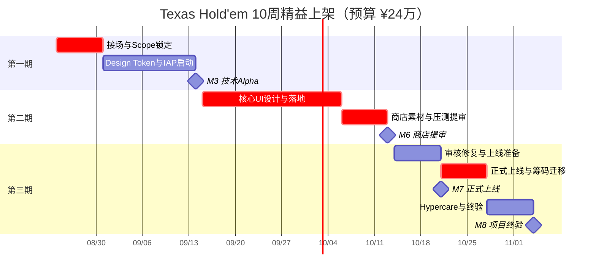
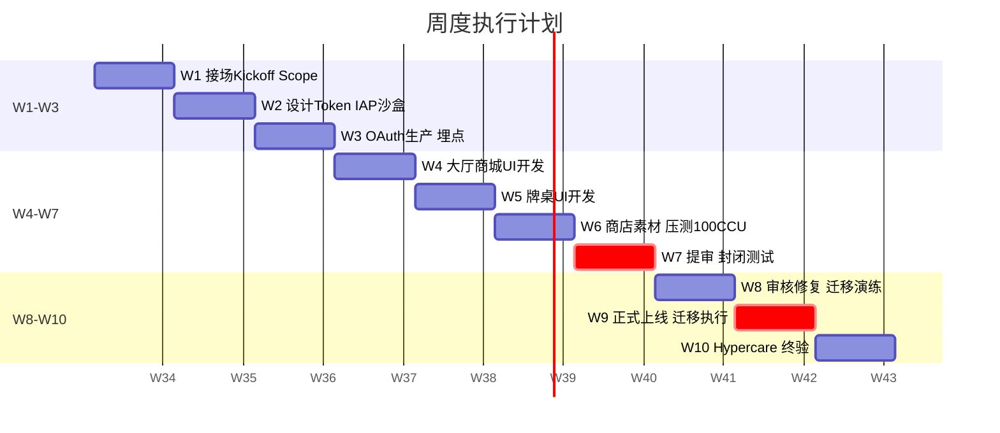
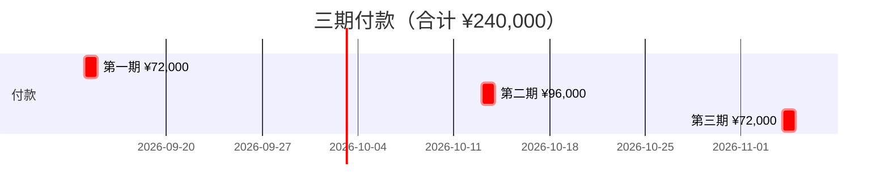

# Texas Hold'em 全项目计划书

| 项目 | 内容 |
|------|------|
| 文档版本 | v2.0 |
| 更新日期 | 2026-08-24 |
| 项目名称 | Texas Hold'em 全球英文区公测上架（v1.1 · 精益版） |
| 交付模式 | **全项目外包**（接场现有代码约 80%） |
| **总周期** | **10 周**（合同签署日起） |
| **项目预算** | **¥240,000**（三期付款；**含**首季云资源） |
| 时间基准 | 合同签署日 = **T0**；W1 = 签约后第 1 周 |
| 代码基线 | `cursor/phase4-open-beta-2fc9` |
| 权威规格 | `PRD-完整版-v2.0.md`、`10-版本范围规划.md` |

---

## 目录

1. [执行摘要](#一执行摘要)
2. [项目背景与目标](#二项目背景与目标)
3. [战略决策（已锁定）](#三战略决策已锁定)
4. [项目范围（精益）](#四项目范围精益)
5. [组织与资源](#五组织与资源)
6. [三期总体计划](#六三期总体计划)
7. [第一期：接场与技术启动（W1 – W3）](#七第一期接场与技术启动w1--w3)
8. [第二期：UI 与上架冲刺（W4 – W7）](#八第二期ui-与上架冲刺w4--w7)
9. [第三期：上线与终验（W8 – W10）](#九第三期上线与终验w8--w10)
10. [WBS 工作分解结构](#十wbs-工作分解结构)
11. [里程碑与验收标准](#十一里程碑与验收标准)
12. [三期付款与交付对照](#十二三期付款与交付对照)
13. [预算总览](#十三预算总览)
14. [风险登记册](#十四风险登记册)
15. [KPI 与成功标准](#十五kpi-与成功标准)
16. [假设与约束](#十六假设与约束)
17. [附录](#十七附录)

---

## 一、执行摘要

Texas Hold'em 是一款跨端社交竞技德州扑克产品。在 **¥24 万 / 10 周** 精益预算下，本项目目标单一明确：

> **10 周内完成全球英文区双端上架、真实 IAP 收款、私人场公测全开。**

### 1.1 三期方案一览

| 期次 | 时间 | 核心目标 | 付款 | 累计 |
|------|------|----------|------|------|
| **第一期** | W1 – W3 | 接场、Scope 锁定、Design Token、IAP/OAuth Alpha | **¥72,000** | ¥72,000 |
| **第二期** | W4 – W7 | 核心 UI 落地、商店素材、压测、**提审** | **¥96,000** | ¥168,000 |
| **第三期** | W8 – W10 | **正式上线**、筹码迁移、终验 | **¥72,000** | **¥240,000** |

### 1.2 与全量方案对比（v1.1 → v2.0）

| 维度 | v1.1 全量 | **v2.0 精益** |
|------|-----------|---------------|
| 周期 | 58 周 | **10 周** |
| 预算 | ¥101 万 | **¥24 万** |
| 前期调研 | 独立 6 周 | **并入 W1（3 天）** |
| UI | PRD 全量拟物化 | **核心路径视觉升级** |
| 压测 | 300 CCU | **100 CCU 轻量报告** |
| QA | 28 人日双轮 | **12 人日单轮 + 终验** |
| Hypercare | 30 天 | **1 周** |
| 运营 / 买量 | 含 52 周计划 | **不含**（上架后另议） |

### 1.3 关键判断

| 维度 | 结论 |
|------|------|
| 可行性前提 | 代码基线 **80%** 已完成；预算用于 **上架 P0 缺口** 而非从零开发 |
| 首发市场 | 全球英文区 |
| 私人场 | 公测即开 |
| 筹码迁移 | 方案 A（清零 + 赠 100） |

> **Gate 规则：** W1 末 Scope Matrix 签字 → 设计 / 研发并行启动。

---

## 二、项目背景与目标

### 2.1 背景

- PRD 与核心代码已就绪；缺口集中在 **原生 IAP、生产 OAuth、核心 UI、商店上架、轻量压测**。  
- ¥24 万 / 10 周要求 **范围做减法**：优先保上架与收款，视觉与运营精细化延后至 v1.1.x 迭代。

### 2.2 项目目标

| # | 目标 | 衡量标准 | 目标周 |
|---|------|----------|--------|
| G1 | 范围锁定 | Scope Matrix 签字 | W1 |
| G2 | 技术 Alpha | IAP 沙盒 + OAuth 生产 | W3 |
| G3 | 核心 UI 可用 | 大厅 + 牌桌 + 商城主路径 | W6 |
| G4 | 商店提审 | 双端提交 | W7 |
| G5 | 正式上线 | 全球英文区可下载 | W9 |
| G6 | IAP 生产到账 | 首笔真实充值 | W9 |
| G7 | 筹码迁移 | 方案 A 执行完成 | W9 |
| G8 | 项目终验 | QA P0=0；付款结清 | W10 |

### 2.3 不在本项目范围（Won't）

- 独立前期调研周（>3 天）  
- PRD 全量拟物化动效 / 全屏精细化  
- 300 CCU 压测、多区域部署  
- v1.5+ 新功能  
- 买量、客服人力、52 周运营计划  
- ASO 多轮迭代（仅 1 轮修订）

---

## 三、战略决策（已锁定）

| # | 决策 | 方案 |
|---|------|------|
| 1 | 首发市场 | 全球英文区 |
| 2 | 私人场 | 公测即开（W9） |
| 3 | 筹码迁移 | 方案 A |
| 4 | 美国买量 | 不列入 T1（上架后另议） |
| 5 | 交付模式 | 外包接场；**三期付款** |
| 6 | 预算纪律 | **¥24 万硬顶**；超范围走 CR 另计费 |

---

## 四、项目范围（精益）

### 4.1 Scope Matrix v1.1 · 精益版

| 优先级 | 模块 | 精益范围 | 验收 |
|--------|------|----------|------|
| **Must** | 接场审计 | Gap 矩阵；P0 清单 | W1 签字 |
| **Must** | 原生 IAP | iOS + Android 生产联调 | 真机到账 |
| **Must** | 生产 OAuth | Apple / Google 真 token | 非 dev-mode |
| **Must** | 核心 UI | 大厅、牌桌、商城、引导（**非全量拟物化**） | 主路径可用 |
| **Must** | 商店上架 | 截图 6 张 + 简版视频；英文文案 | 可提审 |
| **Must** | 法务 | Privacy / ToS / RG（模板 + 修订） | 链接可访问 |
| **Must** | 轻量压测 | **100 CCU**；基础容量结论 | W6 报告 |
| **Must** | 公测迁移 | 方案 A 脚本 + 公告 | W9 执行 |
| **Must** | 私人场 | 公测全开 + 冒烟回归 | W9 |
| **Should** | Firebase 漏斗 | 注册 → 充值 3 事件 | W4 |
| **Should** | Crashlytics | 崩溃监控 | W3 |
| **Won't** | 全量 PRD 视觉 / 动效 | v1.1.x 迭代 | — |
| **Won't** | 300 CCU / 多活 | 不做 | — |

### 4.2 接场基线（已完成 · 不重复计费）

| 模块 | 完成度 |
|------|--------|
| 扑克引擎、官方场、私人场、后台、双榜、合规 API | 90–100% |
| IAP 服务端验单 | 90% |
| 移动端 UI | 功能骨架（需视觉升级） |

---

## 五、组织与资源

### 5.1 精简团队

| 角色 | 投入 | 职责 |
|------|------|------|
| 创始人 | 兼职审批 | Sponsor；48h 内签字 |
| PM | 0.3 FTE × 10 周 | 排期、验收、风险 |
| 高级研发 | 1 人 × 8 周 | IAP、OAuth、UI 落地、部署 |
| UI 设计 | 外包 | Design Token + 核心页 + 牌桌 |
| QA | 0.5 FTE × 4 周 | 冒烟 + 终验 |
| 法务 | 外包模板 | 英文三件套 |

### 5.2 人力合计（精益）

| 角色 | 人日 | 预算占比 |
|------|------|----------|
| 研发 | ~55 | 38% |
| 设计 + 商店 | ~25 | 22% |
| QA | ~12 | 6% |
| 法务 | ~5 | 8% |
| DevOps / 云 | — | 21% |
| PM + 缓冲 | ~10 | 13% |
| **合计** | **~107 人日** | **100%** |

---

## 六、三期总体计划

### 6.1 10 周路线图

```
W1────W3      W4────W7      W8─W10
┃ 第一期 ┃    ┃ 第二期 ┃    ┃第三期┃
 接场/IAP       UI/提审        上线
 ¥7.2万        ¥9.6万        ¥7.2万
```

### 6.2 三期对照总表

| 期次 | 周次 | 周期 | 核心交付 | 里程碑 | 付款 |
|------|------|------|----------|--------|------|
| **第一期** | W1 – W3 | 3 周 | Gap 矩阵、Design Token、IAP/OAuth、Staging | M1–M3 | ¥72,000 |
| **第二期** | W4 – W7 | 4 周 | 核心 UI、商店素材、100 CCU 压测、**提审** | M4–M6 | ¥96,000 |
| **第三期** | W8 – W10 | 3 周 | **上线**、迁移、终验 | M7–M8 | ¥72,000 |

### 6.3 甘特图

> 时间基准：**T0 = 2026-08-24**（合同签署日）。

**图 1 · 10 周项目总路线图**



**图 2 · 周度任务甘特（W1 – W10）**



**图 3 · 三期付款节点**



---

## 七、第一期：接场与技术启动（W1 – W3）

**预算：¥72,000 · 付款：W3 验收后**

### 7.1 阶段目标

3 天内完成接场与 Scope 锁定；W3 末 IAP 沙盒 + OAuth 生产可用。

### 7.2 周度任务

| 周次 | 任务 | 交付物 |
|------|------|--------|
| **W1** | 接场 kickoff；快速 Scope 评审（PRD 已有） | Gap 矩阵；**Scope Matrix 签字** |
| **W1** | 设计启动；法务模板选型 | Figma 项目；法务合同 |
| **W1** | Staging 环境搭建 | Staging URL |
| **W2** | Design Token + 核心页线稿 | Token 文档；大厅 / 商城框架 |
| **W2** | IAP 沙盒联调（iOS + Android） | 沙盒 E2E 录像 |
| **W2** | App 图标 | 商店 + App 内图标 |
| **W3** | 生产 OAuth 验签 | 真 token 登录 |
| **W3** | Firebase 核心事件 + Crashlytics | 3 个漏斗事件 |
| **W3** | 清档脚本 Staging 演练 | 方案 A 演练记录 |
| **W3** | **第一期验收** | 验收报告 |

### 7.3 交付物

| # | 交付物 | 验收 |
|---|--------|------|
| D1-01 | Gap 矩阵 + Scope Matrix | 创始人签字 |
| D1-02 | Design Token + 核心页线稿 | 评审通过 |
| D1-03 | IAP 沙盒 E2E | 双端各 1 笔 |
| D1-04 | OAuth 生产可用 | 非 dev-mode |
| D1-05 | Staging 环境 | 72h 稳定 |

---

## 八、第二期：UI 与上架冲刺（W4 – W7）

**预算：¥96,000 · 付款：W7 验收后**

### 8.1 阶段目标

核心 UI 代码落地；商店素材齐备；100 CCU 压测；**W7 双端提审**。

### 8.2 周度任务

| 周次 | 任务 | 交付物 |
|------|------|--------|
| **W4** | 大厅 / 商城 / 设置 UI 落地 | Staging 可体验 |
| **W4** | 牌桌 UI 设计定稿 | Figma 牌桌稿 |
| **W5** | 牌桌 UI 代码落地 | Table 主路径可用 |
| **W5** | 弹窗 / 引导 / 破产流程 | 核心弹窗完成 |
| **W6** | 商店截图 6 张 + 简版视频 | 可提审素材包 |
| **W6** | 英文 Privacy / ToS / RG 初稿 | 法务评审 |
| **W6** | **100 CCU 轻量压测** | 容量报告 |
| **W6** | 生产环境部署 | Prod 环境 + 基础监控 |
| **W7** | QA 冒烟（官方场 + 私人场 + IAP） | P0 = 0 |
| **W7** | **iOS + Android 提审** | 提审回执 |
| **W7** | TestFlight / Play 内测 30 人 | 内测反馈清单 |
| **W7** | **第二期验收** | 验收报告 |

### 8.3 交付物

| # | 交付物 | 验收 |
|---|--------|------|
| D2-01 | 核心 UI（大厅 + 牌桌 + 商城） | 主路径无 P0 |
| D2-02 | 商店截图 + 视频 + 英文文案 | 可用于提审 |
| D2-03 | 《100 CCU 压测报告》 | 无致命瓶颈 |
| D2-04 | 生产环境 + 监控 | API / Room 可用 |
| D2-05 | 提审回执 | 已提交 |
| D2-06 | QA 冒烟报告 | P0 = 0 |

---

## 九、第三期：上线与终验（W8 – W10）

**预算：¥72,000 · 付款：W10 终验后**

### 9.1 阶段目标

W9 全球发布；方案 A 迁移；1 周 Hypercare；W10 项目 closure。

### 9.2 周度任务

| 周次 | 任务 | 交付物 |
|------|------|--------|
| **W8** | 审核反馈修复（如有） | 修复版本 |
| **W8** | 法务终稿上线 | 三件套 URL |
| **W8** | 迁移公告 T-7；生产演练 | 公告文案 |
| **W9** | **全球英文区正式上线** | 商店可下载 |
| **W9** | 私人场全开 | 回归确认 |
| **W9** | 方案 A 筹码迁移执行 | 迁移日志 |
| **W9** | 生产 IAP 首笔验证 | 对账记录 |
| **W10** | UI / 商店 1 轮修订（如有） | 修订记录 |
| **W10** | QA 终验 + Hypercare 报告 | P0 = 0 |
| **W10** | **项目终验** | 终验报告 + 签字 |

### 9.3 交付物

| # | 交付物 | 验收 |
|---|--------|------|
| D3-01 | 上线公告 + 商店链接 | 双端可下载 |
| D3-02 | 筹码迁移执行记录 | 脚本成功 |
| D3-03 | 生产 IAP 首笔 | 到账确认 |
| D3-04 | 法务终稿 | 链接有效 |
| D3-05 | QA 终验报告 | P0 = 0 |
| D3-06 | 《项目终验报告》 | 创始人签字 |

---

## 十、WBS 工作分解结构

```
1. Texas Hold'em v1.1 精益上架 [¥240,000 · 10周]
├── 1.1 第一期 W1-W3 [¥72,000]
│   ├── 1.1.1 接场审计 + Scope
│   ├── 1.1.2 Design Token + 图标
│   ├── 1.1.3 IAP 沙盒 + OAuth 生产
│   ├── 1.1.4 Staging + Crashlytics + 埋点
│   └── 1.1.5 清档脚本演练
├── 1.2 第二期 W4-W7 [¥96,000]
│   ├── 1.2.1 核心 UI 设计与落地
│   ├── 1.2.2 商店素材 + 法务初稿
│   ├── 1.2.3 100 CCU 压测 + Prod 部署
│   ├── 1.2.4 QA 冒烟
│   └── 1.2.5 商店提审
└── 1.3 第三期 W8-W10 [¥72,000]
    ├── 1.3.1 审核修复 + 法务终稿
    ├── 1.3.2 正式上线 + 筹码迁移
    ├── 1.3.3 Hypercare 1 周
    └── 1.3.4 终验 + Closure
```

---

## 十一、里程碑与验收标准

| 里程碑 | 时间 | 通过条件 | 付款 |
|--------|------|----------|------|
| M1 接场 | W1 | Gap + Scope 签字 | — |
| M2 设计启动 | W2 | Design Token 评审 | — |
| **M3 技术 Alpha** | **W3** | IAP 沙盒 + OAuth 生产 | **¥72,000** |
| M4 核心 UI | W6 | 大厅 + 牌桌 + 商城可用 | — |
| M5 压测 | W6 | 100 CCU 报告 | — |
| **M6 提审** | **W7** | 双端已提交 | **¥96,000** |
| **M7 上线** | **W9** | 商店可下载；私人场全开 | — |
| **M8 终验** | **W10** | QA P0=0；文档齐全 | **¥72,000** |

---

## 十二、三期付款与交付对照

| 期次 | 金额 | 占比 | 验收周 | 核心交付 |
|------|------|------|--------|----------|
| **第一期** | **¥72,000** | 30% | W3 | D1-01 ~ D1-05 |
| **第二期** | **¥96,000** | 40% | W7 | D2-01 ~ D2-06 |
| **第三期** | **¥72,000** | 30% | W10 | D3-01 ~ D3-06 |
| **合计** | **¥240,000** | 100% | | |

> 付款节点：验收通过后 **5 个工作日内**。

---

## 十三、预算总览

| 类别 | 金额 | 期次 | 说明 |
|------|------|------|------|
| 接场审计 + Scope | ¥10,000 | 第一期 | W1 |
| IAP / OAuth / 埋点 / 清档 | ¥45,000 | 第一–二期 | 技术冲刺 |
| UI 设计（核心） | ¥32,000 | 第一–二期 | Token + 牌桌 |
| UI 落地（核心路径） | ¥40,000 | 第二期 | 研发 |
| 商店素材 | ¥15,000 | 第二期 | 截图 + 简版视频 |
| 法务合规（模板） | ¥18,000 | 第二–三期 | 英文三件套 |
| QA（精简） | ¥14,000 | 第二–三期 | 冒烟 + 终验 |
| DevOps + 部署 | ¥12,000 | 第一–二期 | Staging + Prod |
| PM + 项目管理 | ¥12,000 | 全程 | 10 周 |
| 不可预见费 | ¥14,000 | 全程 | 审核驳回等 |
| 云资源 + SaaS（首季） | ¥38,000 | 第一–三期 | 含在总包内 |
| **合计** | **¥240,000** | | **硬顶** |

### 13.1 不含在 ¥24 万内

- 用户买量、客服人力  
- v1.1.x 视觉精修、ASO 第 2 轮起  
- 300 CCU 全量压测  
- IAP 流水平台抽成（15%–30%）

---

## 十四、风险登记册

| ID | 风险 | 概率 | 影响 | 应对 |
|----|------|------|------|------|
| R01 | ¥24 万不够覆盖全 PRD 视觉 | 高 | 高 | Scope 精益版；精修走 v1.1.x CR |
| R02 | 10 周无法过审 | 中 | 高 | W7 提审；W8 预留修复；法务模板前置 |
| R03 | IAP 联调超时 | 中 | 高 | W2 启动；第一期专款 |
| R04 | 牌桌 UI 压缩过度 | 中 | 中 | W5 创始人评审；仅保主路径 |
| R05 | 创始人签字延迟 | 中 | 中 | 48h SLA；逾期顺延不计供应商责任 |
| R06 | 商店审核驳回 | 中 | 高 | 不可预见费 ¥1.4 万；W8 修复 |

---

## 十五、KPI 与成功标准

### 15.1 项目成功定义（W10）

1. App Store + Google Play 可下载  
2. 生产 IAP 首笔到账  
3. 私人场全开；冒烟回归通过  
4. 方案 A 迁移执行完成  
5. QA 终验 P0 = 0  
6. ¥24 万三期付款结清  

### 15.2 上架后指标（参考，非本项目交付）

| 指标 | 上架后 30 天参考 |
|------|------------------|
| 累计注册 | 500 – 2,000 |
| D7 留存 | ≥ 10% |
| Crash-free | ≥ 99% |

---

## 十六、假设与约束

### 16.1 假设

1. 代码基线 `phase4-open-beta-2fc9` 无 P0 架构缺陷  
2. 创始人 W1 完成 Scope 签字；里程碑 48h 内批复  
3. Apple / Google 账号与 IAP 商品配置由甲方提供  
4. PRD 全量拟物化**不在** ¥24 万范围内  

### 16.2 约束

1. **预算硬顶 ¥240,000**  
2. **周期硬顶 10 周**（自 T0 起）  
3. 设计修订每阶段 **≤1 轮**  
4. 压测上限 **100 CCU**  

---

## 十七、附录

### 附录 A：文档索引

| 文档 | 路径 |
|------|------|
| 产品 PRD | `docs/PRD-完整版-v2.0.md` |
| 全量版计划书（对照） | Git 历史 v1.1 |
| 商业化启动计划书 | `docs/11-商业化启动计划书.md` |

### 附录 B：签字页

| 角色 | 姓名 | 签字 | 日期 |
|------|------|------|------|
| 项目 Sponsor（创始人） | | | |
| 项目经理 | | | |

> 签字即表示认可 **¥24 万 / 10 周 / 三期** 精益范围，并授权 **W1** 启动。

---

*本文档 v2.0 为精益上架方案；全量 58 周 / ¥101 万方案见 Git 历史 v1.1。*
